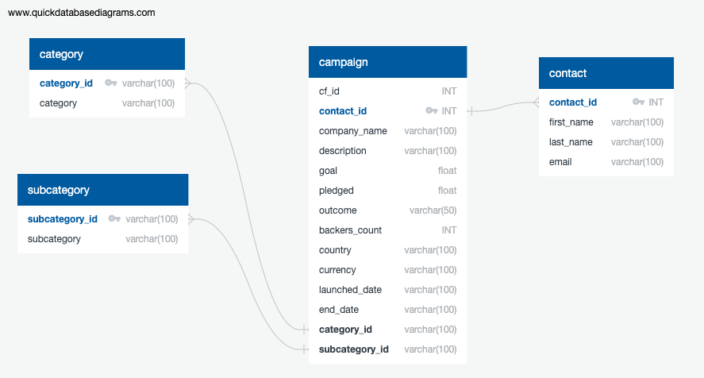
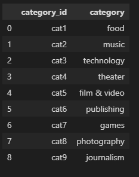
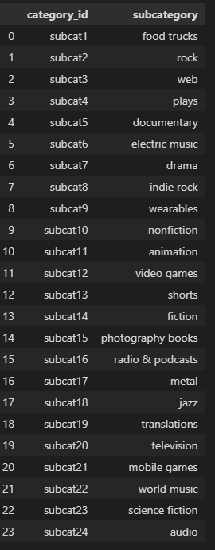

# Crowdfunding_ETL

## UCI Data Analytics Bootcamp - Project 2

Due Date : Thursday, January 12, 2023

# **Group Members** - Group 4

Chika Okam

David Campos

Jonathan Rico

Lissette Escobedo

Patricia Roa

Robert Hascall

Roy Jiang

Vincent Passanisi

# **Introduction**

For this project, we were presented with two different sets of data: crowdfunding information and contacts information in the form of csv files.
The challenge was to use the extract, transform, and load process to refine, restructure, and consolidate the information based on their relationship to each other.

# **Files**

* **README.md** file with information about the project
* **Starter_Files** folder - contains the following project files for Group 4.

* **ETL_Mini_Project_Final_Group4.ipynb** - Completed notebook file for group 4. Contains solutions for both option 1 and 2.
* **crowdfunding_db_schema.sql** - SQL file with table schema and query to demonstrate all tables created coreectly with primary and foreign keys.
* **ETL_ERD_Group_4.png** - image file of ERD table schema
* **Resources** folder contains the provided Excel Files
    * *contacts.xlsx*
    * *crowdfunding.xlsx*
* **output** folder contains dataframe results from notebook saved as .csv files
    * campaign.csv
    * category.csv
    * contacts_option1.csv
    * contact_option2.csv
    * subcategory.csv
    * postgres_select_campaign.png
    * postgres_select_category.png
    * postgres_select_contacts.png
    * postgres_select_subcategory.png

# **Results**

For the ETL mini project, we demonstrated an ETL pipeline using Python, Pandas, and both Python dictionary methods and regular expressions methods to extract and transform the data.
Afterward, we created four CSV files and use the CSV file data to create an ERD and a table schema.

Finally, we uploaded the CSV file data into a Postgres database and successfully imported all data from dataframes.

*category.csv* contains 9 rows that has category_id named from “cat1” to “cat9".

*subcategory.csv* contains 10 rows that has subcategory_id named from “subcat1” to “subcat10".

We used both option 1 and option 2 to create the contact dataframe, the dataframe contains column name “contact_id”, “first_name”, “last_name”, “email”.
campaign.csv was first cleaned from *crowdfunding.xlsx* and the dataframe contains column name “cf_id”, “contact_id”, “company_name”, “description”, “goal”, “pledged”, “outcome”,“backers_count”, “country”, “currency”, “launched_date”, “end_date”, “category_id”, “subcategory_id”.

# **Comments and Thoughts**

Jonathan : Building an ETL pipeline is key to facilitate data analysis, without this pipeline, we wouldn't be able to clean up the data and load it into a database for effective analysis. The most interesting part of this project was the fact that we can use either Python dictionary methods or regular expressions to extract and transform the data.

Patricia : I think the most interesting part of this project for me is seeing the additional ways that data can be sort of dismantled and then restructured in a better way. I noticed that through this process, it became easier to relate certain parts of the data to others. The extraction and transformation process was interesting because although it was challenging, the result made it worth the work, which was a well-integrated dataset and table that is functional, clean, and easy to understand.

Chika: Collaborating on this project was such an enriching experience for me. Every team member’s contribution provided valuable insights at every stage of the process, with unique problem-solving skills. I was fascinated by how everyone leveraged their understanding of concepts taught in class to solve problems with real-world data. The experience was a practical application of data cleansing, data analysis, data modeling, and data engineering.

Robert: I found that this project demonstrated the team aspect of working with Github in a more meaningful way than Project 1. It allowed us to practice, in a real team environment, creating a branch and moving between our branches and main. Additionally, the project itself, relating to ETL, was valuable in demonstrating the “process” of gathering (extracting), manipulating (transforming) and loading the data. This being the foundation before any data analysis can even begin. Understanding this process further demonstrated to me the work involved in data analytics when it also includes the analysis of the data post-ETL. The breadth of the field of data analytics is clearer to me after this project.

Roy: Data cleaning and reconstruction are crucial and fundamental for further advanced data analysis. Without a streamlined program and cleaned dataframes, it would be challenging to read and understand large amount of datasets. It was challenging at the beginning to learn various data cleaning techniques such as regular expression but great group collaboration allowed us to generate well-functional dataframes and databases. It will be interesting to integrate with matplotlib to put these databases into plot perspectives for trending analysis.

Vincent : I was fortunate to have a great group to work with. Collaboration was outstanding. Everyone contributed and it was apparent that we all had different strengths. Communication was key, and we made good use of Slack to keep each other apprised of our progress. Even with different schedules, we all managed to complete the various sections. I was really impressed with the amount of collaborattion and cooperation.

